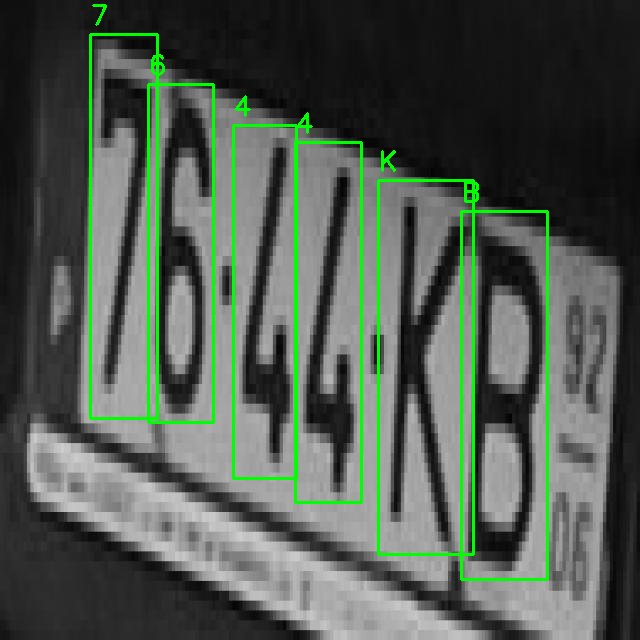
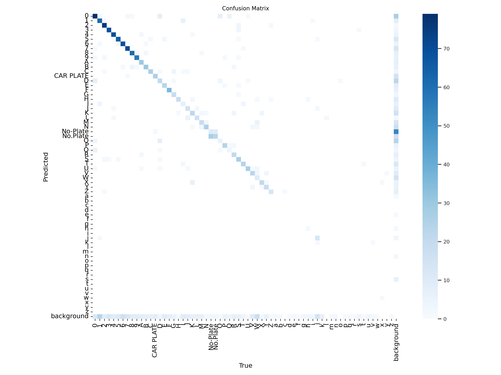
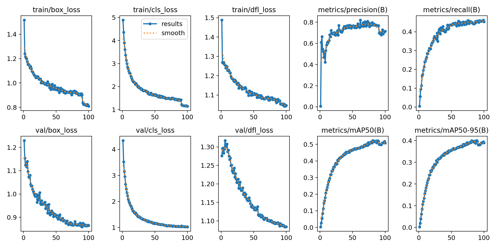
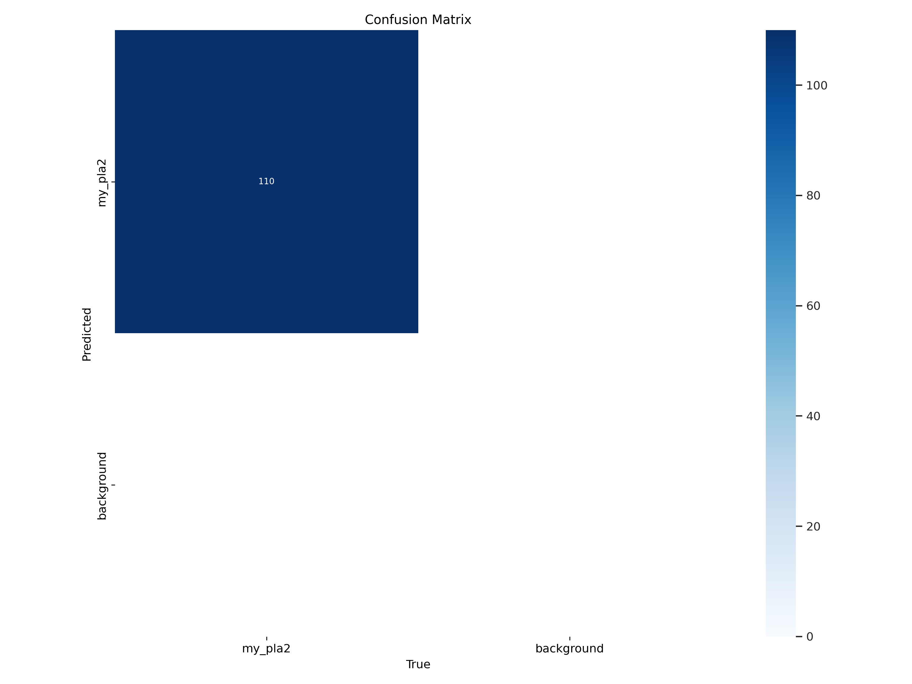
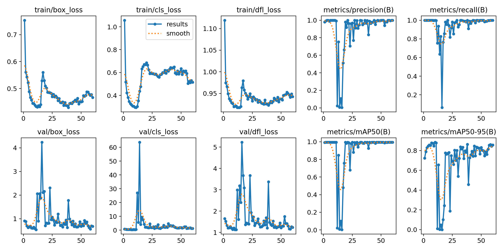

# License Plate OCR and 130 Classes YOLOV8

Training and validation with yolov8 with the [license-plate roboflow](https://universe.roboflow.com/experimentrobo/license-plate-in3uk/dataset/2) dataset (detect labeling) with transfer learning with ocr detect and 130 classes .

-----

## 130 classes

#### Validation Results

  

#### Confusion Matrix

  

#### Results

  

-----

## 1 class OCR 

#### Validation Results

  

#### Confusion Matrix

  

#### Results

  

Conclusion: After comparing both models and strategies to use, the best model to use is the 130-class model because it detects plates in different directions and angles, but when applying the OCR this is difficult or it was not detected. But for both models it is vital to have control in the environment because if it has drastic changes it will make the detection task even more difficult. And it is also key to have a clear dataset set to complete your task, since it was shown that using the 130-class model the other 1-class dataset made it difficult to perform the task.

Spanish:
Conclusión: Después de comparar ambos modelos y estrategias para usar el mejor modelo para usar es el de 130 clases debido a que detecta las placas en diferentes dierrecciones y angulos , en cambio al aplicar el ocr esto se le dificulta o no detectaba .Pero para los dos modelos es vital tener un control en entorno debido a que si este tiene cambios drasticos dificultará aun mas la tarea de detección .Y tambien es clave tener un conjunto de dataset claro a su tarea complir , ya que se demostró que usar el modelo de 130 clases al otro dataset de 1 clase se le dificultó al realizar la tarea.